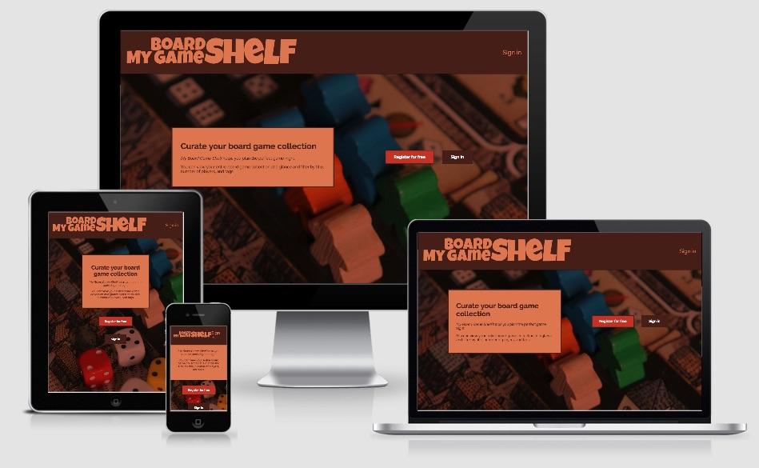
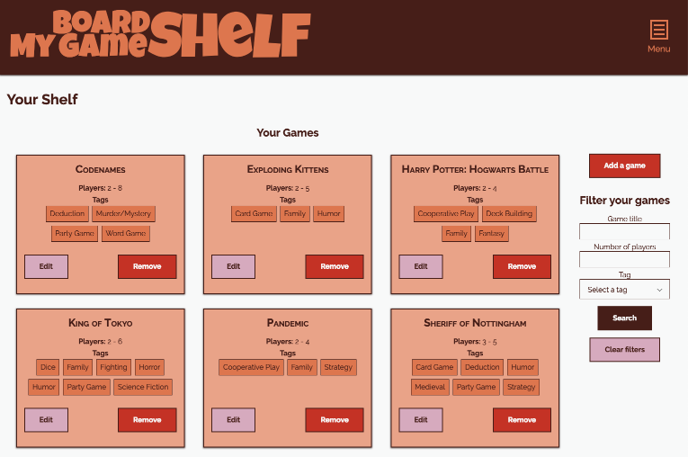

# My Board Game Shelf

*My Board Game Shelf* is an app for organizing and filtering your board game collection. You can check it out at https://my-board-game-shelf.herokuapp.com.

## Features

- Users can see all their board games sorted alphabetically
- Filters for game title, number of players, and tag
- Ability to add, edit, and remove individual games from a user's shelf.
- User can delete their own account if they no longer wish to use the app.

## Previews

Dashboard

## Tech Stack:

- [React](https://reactjs.org/) with [Redux](https://redux.js.org/) for state management and [React Router](https://reacttraining.com/react-router/) for routing.
- [Redux Form](https://redux-form.com) with [React Responsive Select](https://github.com/benbowes/react-responsive-select/) for custom select elements.
- [react-burger-menu](https://github.com/negomi/react-burger-menu) and [redux-burger-menu](https://github.com/negomi/redux-burger-menu) for the animated menu.

## To Deploy

`git push heroku master`

## Learn More

Documentation for the back-end API can be found at https://github.com/derekhouck/My-Board-Game-Shelf-API.

This app was originally created as a project for [Thinkful's Engineering Immersion program](https://www.thinkful.com/bootcamp/web-development/full-time/).